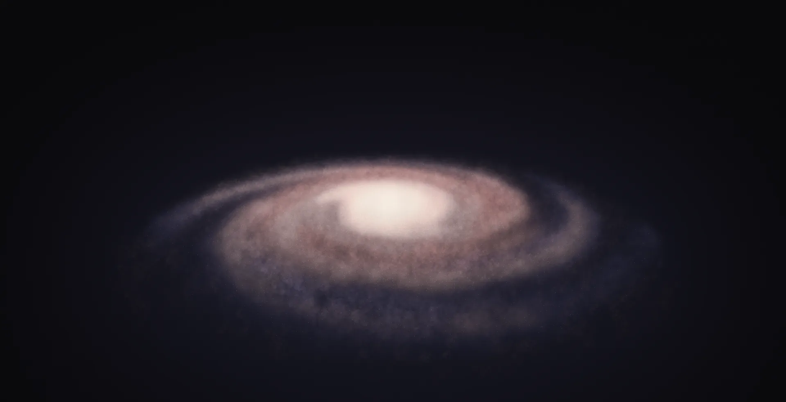
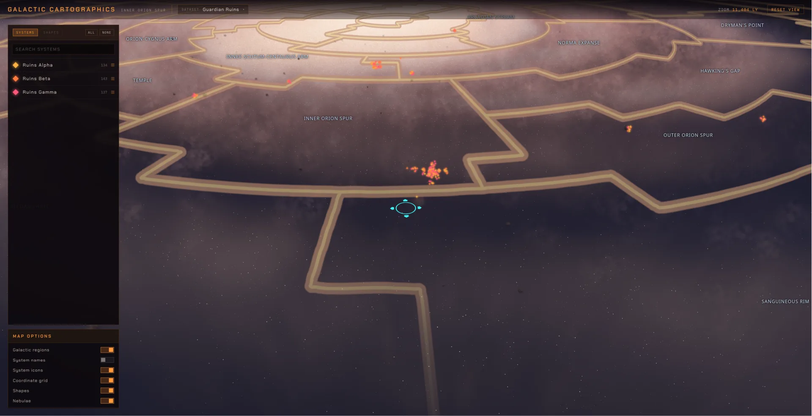
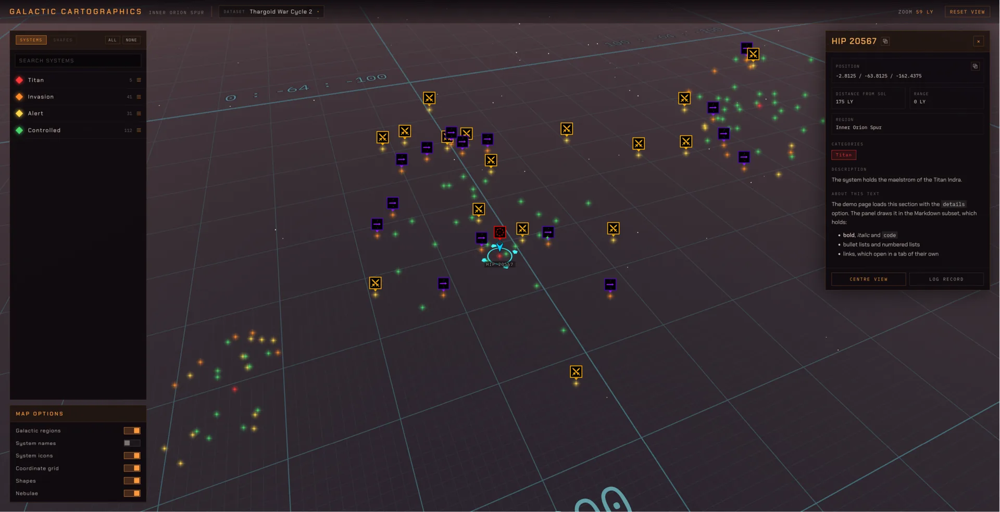
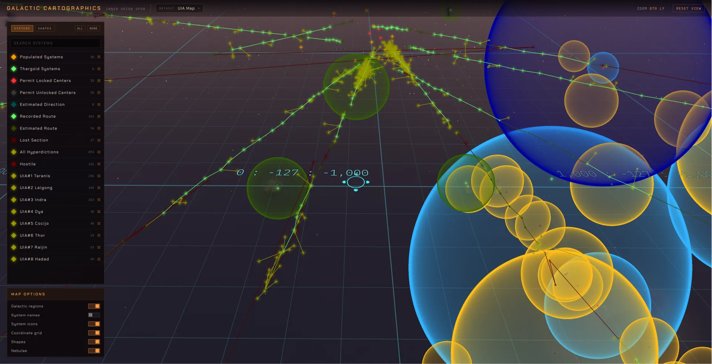
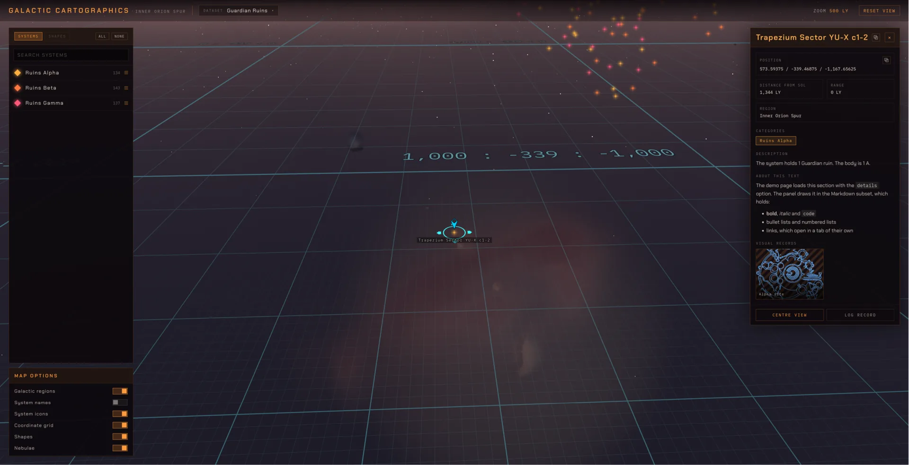

# Elite Dangerous Galaxy Map

An interactive 3D map of the Elite Dangerous galaxy, drawn in the browser with WebGL2.

The map draws the galaxy from a density model of the game's stellar mass. Over it, it
draws your star systems as markers, the codex region boundaries, spheres and lines, an
optional set of nebulae and an optional HUD. You add the data and read what the user
selects. The map owns the canvas, the camera and the frame loop. It fetches none of your
data, and it reads and writes no URL.

- Demo site: <https://elite-dangerous-almanac.github.io/Galaxy-Map/>
- API reference: <https://github.com/Elite-Dangerous-Almanac/Galaxy-Map/wiki>

## Screenshots

[](docs/screenshots/screenshot01.webp)

|                                                                                                                          |                                                                                                                             |
| ------------------------------------------------------------------------------------------------------------------------ | --------------------------------------------------------------------------------------------------------------------------- |
| [](docs/screenshots/screenshot02.webp) | [](docs/screenshots/screenshot03.webp) |
| [](docs/screenshots/screenshot04.webp)            | [](docs/screenshots/screenshot05.webp)                 |

## Install

```bash
pnpm add @elite-dangerous-almanac/galaxy-map
```

The map needs a browser with WebGL2 and a GPU the browser can reach. It refuses to draw
on a software renderer. Give it a `<canvas>` that you own and size with CSS.

The nebulae are an **opt-in** subpath, `@elite-dangerous-almanac/galaxy-map/nebulae`.
They add 2,912,225 bytes of volume files, transfer tables and the index to your build. A
build that does not import the subpath carries none of it.

## Samples

Each sample is a page of the demo site. The wiki page explains each call.

- **Systems on the map** — [the page](https://elite-dangerous-almanac.github.io/Galaxy-Map/examples/systems-on-the-map/), [the wiki page](https://github.com/Elite-Dangerous-Almanac/Galaxy-Map/wiki/Systems-on-the-map)
- **A record with details** — [the page](https://elite-dangerous-almanac.github.io/Galaxy-Map/examples/a-record-with-details/), [the wiki page](https://github.com/Elite-Dangerous-Almanac/Galaxy-Map/wiki/A-record-with-details)
- **The system icons** — [the page](https://elite-dangerous-almanac.github.io/Galaxy-Map/examples/the-system-icons/), [the wiki page](https://github.com/Elite-Dangerous-Almanac/Galaxy-Map/wiki/The-system-icons)
- **The HUD** — [the page](https://elite-dangerous-almanac.github.io/Galaxy-Map/examples/the-hud/), [the wiki page](https://github.com/Elite-Dangerous-Almanac/Galaxy-Map/wiki/The-HUD)
- **The camera** — [the page](https://elite-dangerous-almanac.github.io/Galaxy-Map/examples/the-camera/), [the wiki page](https://github.com/Elite-Dangerous-Almanac/Galaxy-Map/wiki/The-camera)
- **The view in a URL** — [the page](https://elite-dangerous-almanac.github.io/Galaxy-Map/examples/the-view-in-a-url/), [the wiki page](https://github.com/Elite-Dangerous-Almanac/Galaxy-Map/wiki/The-camera)
- **Spheres and lines** — [the page](https://elite-dangerous-almanac.github.io/Galaxy-Map/examples/spheres-and-lines/), [the wiki page](https://github.com/Elite-Dangerous-Almanac/Galaxy-Map/wiki/Spheres-and-lines)
- **A dataset catalog** — [the page](https://elite-dangerous-almanac.github.io/Galaxy-Map/examples/a-dataset-catalog/), [the wiki page](https://github.com/Elite-Dangerous-Almanac/Galaxy-Map/wiki/A-dataset-catalog)
- **The nebulae** — [the page](https://elite-dangerous-almanac.github.io/Galaxy-Map/examples/the-nebulae/), [the wiki page](https://github.com/Elite-Dangerous-Almanac/Galaxy-Map/wiki/The-nebulae)

## Controls

| Input           | What it does                                                                  |
| --------------- | ----------------------------------------------------------------------------- |
| Left click      | Selects the system under the pointer. A click on nothing keeps the selection. |
| Left drag       | Turns the camera around the cursor.                                           |
| Right drag      | Moves the cursor in the galactic plane, under the pointer.                    |
| Wheel           | Zooms, between 10 light years and the far limit of the bound.                 |
| `W` `A` `S` `D` | Move the cursor in the plane, relative to the camera.                         |
| `R` `F`         | Move the cursor up and down.                                                  |
| `Q` `E`         | Turn the camera around the cursor.                                            |
| `Escape`        | Unwinds one step: the dataset dialog, then the lightbox, then the selection.  |

## License

[LICENSE.md](LICENSE.md) is the PolyForm Noncommercial License 1.0.0, which covers this
project's own code. [THIRD_PARTY_NOTICES.md](THIRD_PARTY_NOTICES.md) states the terms of
the data and the art the map draws. Read both: several of the sources are noncommercial
as well.

## Contributing

Read [CONTRIBUTING.md](CONTRIBUTING.md).
